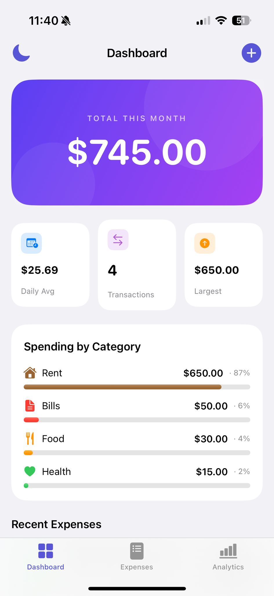
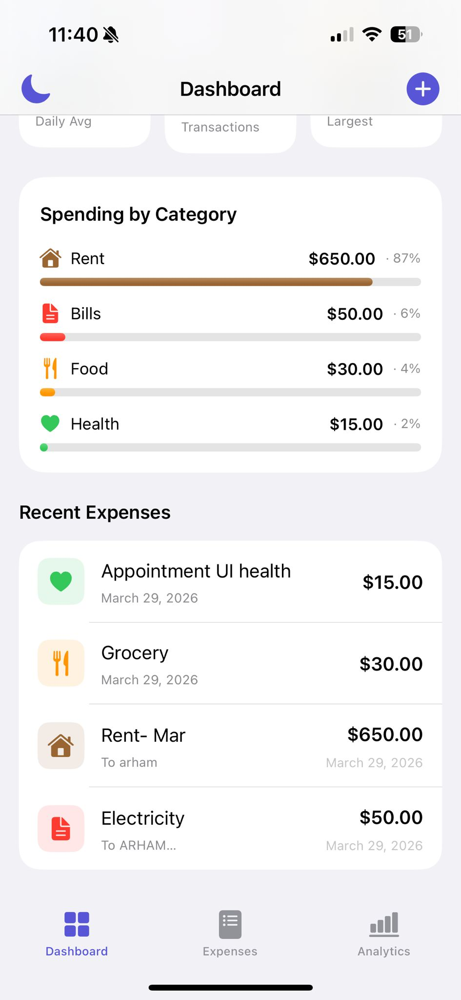
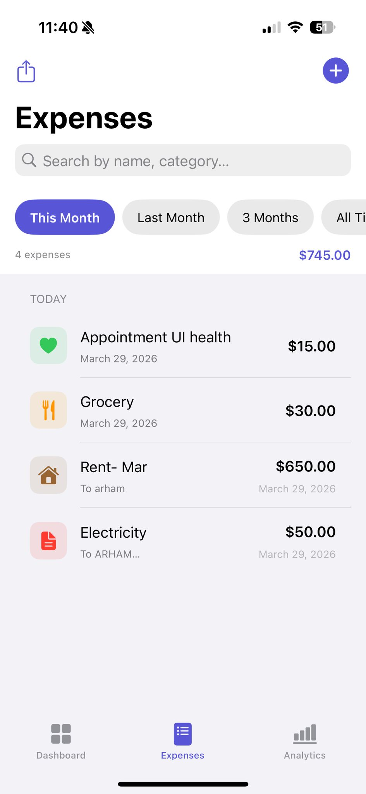
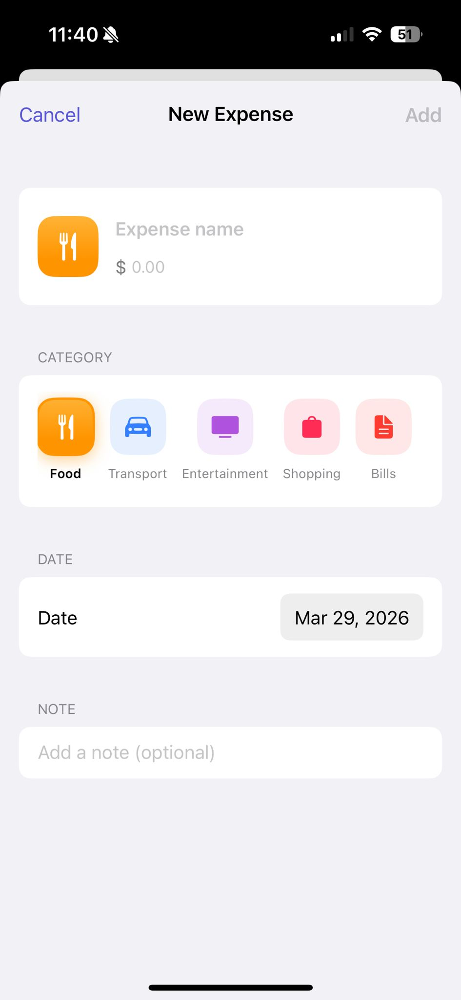
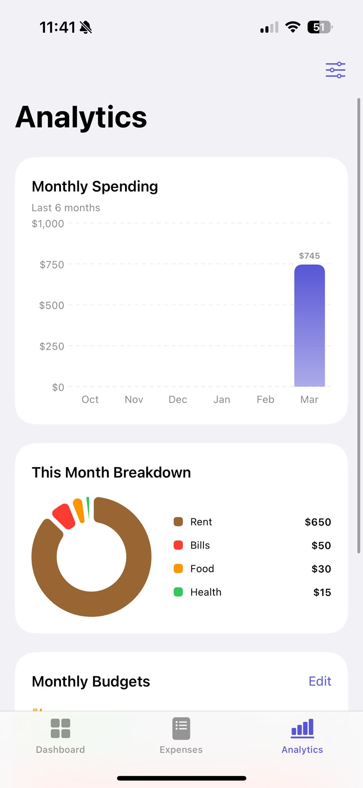
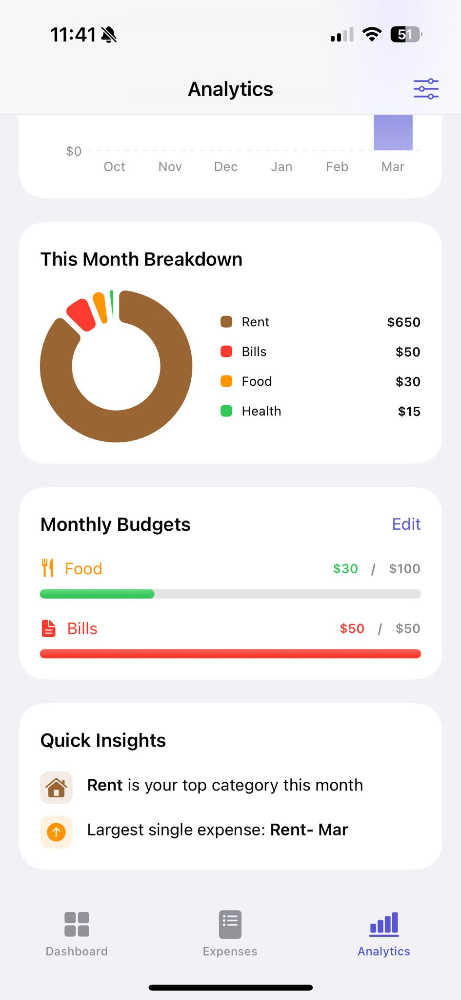
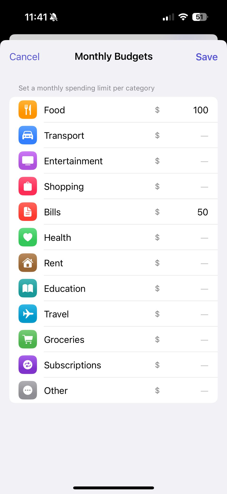

# Expense Tracker

A clean, fully-featured personal finance app built with SwiftUI. Track expenses, set category budgets, visualize spending trends, and export your data — all stored locally on-device with no account required.

---

## Screenshots

### Dashboard
<p float="left">
  
  
</p>

### Expenses
<p float="left">
  
  
</p>

### Analytics & Budgets
<p float="left">
  
  
  
</p>

---

## Features

### Dashboard
- Monthly spending total with month-over-month percentage change
- Daily average, transaction count, and largest expense stats
- Top spending categories with visual progress bars
- Recent transactions at a glance

### Expense Management
- Add, edit, and delete expenses with swipe actions
- 12 predefined categories (Food, Transport, Bills, Health, Travel, and more)
- Optional notes per expense
- Full-text search across name, category, and notes
- Filter by time period: This Month, Last Month, 3 Months, All Time

### Analytics
- 6-month spending bar chart
- Donut chart for this month's category breakdown
- Per-category budget setting with color-coded progress (green / orange / red)
- Quick insights: top category, largest expense, spending change

### Data & Export
- All data persisted locally via `UserDefaults` (no account required)
- CSV export for any filtered view
- Dark mode with persistent preference

---

## Tech Stack

| Layer | Technology |
|-------|------------|
| UI | SwiftUI |
| Charts | Swift Charts (Apple native) |
| State Management | `ObservableObject` / `@Published` |
| Persistence | `UserDefaults` + `Codable` |
| Architecture | MVVM |
| Dependencies | None (pure SwiftUI) |

**Minimum deployment target:** iOS 16+

---

## Project Structure

```
Expense Tracker/
├── saaaadApp.swift          # App entry point
├── ContentView.swift        # Tab navigation + ExpenseRow component
├── DashboardView.swift      # Home screen with stats and recents
├── ExpenseListView.swift    # Searchable/filterable expense list
├── AddExpenseView.swift     # Add / edit expense form
├── AnalyticsView.swift      # Charts, budgets, and insights
├── Expense.swift            # Data models (Expense, Category, TimePeriod)
└── ExpenseStore.swift       # ViewModel — CRUD, filtering, persistence, export
```

---

## Data Models

```swift
struct Expense: Identifiable, Codable {
    var id: UUID
    var name: String
    var amount: Double
    var category: Category
    var date: Date
    var note: String
}
```

**Categories:** Food · Transport · Entertainment · Shopping · Bills · Health · Rent · Education · Travel · Groceries · Subscriptions · Other

---

## Getting Started

1. Clone the repo
2. Open `Expense Tracker.xcodeproj` in Xcode
3. Select a simulator or connected device (iOS 16+)
4. Build and run (`Cmd + R`)

No additional setup, accounts, or API keys required.

---

## License

MIT
